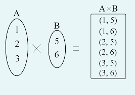
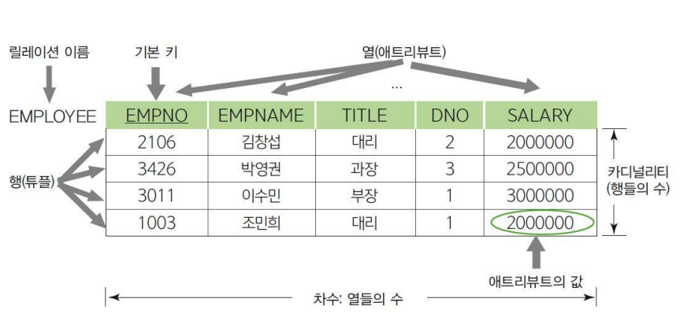

# 데이터베이스 개요

<h3>DB와 DBMS에 대해 설명하세요.</h3>

#### Database(DB)
- 구조화된 방식으로 관련있는 데이터를 전자적으로 저장한 집합
- 물리적 데이터뿐 아니라 이를 다루는 스키마 및 메타데이터까지 포함함

#### Database Management System(DBMS)
- 사용자에게 DB를 정의, 생성, 관리하는 기능을 제공하는 소프트웨어 시스템(e.g. MySQL, PostgreSQL, Oracle 등)
- 데이터를 저장하고 검색하는 기본 기능 외에도 동시성 제어, 트랜잭션 관리, 보안 등의 기능도 제공함

#### Database System
- DB, DBMS, 그리고 DBMS와 상호작용하는 프로그램 및 하드웨어를 포함한 개념
- 특정 문맥에서는 데이터베이스 시스템을 단순히 DB라고 부르기도 함

<h3>DB의 메타데이터에 대해 설명하세요.</h3>

- DB를 정의하거나 기술하는 정보(e.g. 데이터 타입, 데이터 구조, 제약 조건, 인덱스, 사용자 그룹, 보안 등)
- 카탈로그(Catalog)라고도 하며, 메타데이터가 저장되는 곳을 지칭할 때 이 용어를 쓰기도 함
- DBMS를 통해 관리됨

<h3>데이터 모델에 대해 설명하세요.</h3>

#### 개념
- DB의 구조를 기술하는데 사용되는 개념들의 집합
- 데이터 타입, 데이터 간 관계, 제약 조건 등을 정의하며, 이를 추상화해 표현할 수 있는 수단을 제공
- DB의 읽기 및 쓰기와 같은 기본 연산(operation)도 포함함

 

#### 종류
##### 개념적 데이터 모델(Conceptual Data Model)
- 일반 사용자와 개발자 모두 이해할 수 있는 추상적이고 고수준의 데이터 모델
- 주로 ER(Entity-Relationship) 모델을 사용하여 현실 세계의 데이터를 개체(entity), 속성(attribute), 관계(relationship)로 표현함

 

##### 논리적 데이터 모델(Logical Data Model)
- 개념적 데이터 모델을 구현 가능한 형태로 변환한 데이터 모델
- 특정 DBMS에 종속적으로 설계되면 안됨
- 관계형(Relational), 객체형(Object), 객체-관계형(Object-relational) 데이터 모델 등이 있으며, 관계형 데이터 모델이 가장 널리 사용됨

 

##### 물리적 데이터 모델(Physical Data Model)
- 논리적 데이터 모델을 기반으로 데이터가 실제로 하드웨어에 저장되고 관리되는 방식을 정의한 데이터 모델
- 데이터 저장소 구조 및 접근 경로(access path) 등을 정의함
- 접근 경로는 데이터 검색을 빠르게 하기 위한 구조체로, 인덱스(index) 등이 대표적임 

<h3>DB 상태에 대해 설명하세요.</h3>

- 특정 시점에 DB에 저장된 모든 데이터의 집합
- DB 인스턴스 또는 스냅샷(snapshot)이라고 부름

<h3>스키마에 대해 설명하세요.</h3>

- 데이터 모델을 바탕으로 DB의 구조, 제약 조건, 데이터 관계 등을 정의한 설계도
- DB 설계 과정에서 결정되며, 일반적으로 최초 정의된 후 자주 변경되지 않음

<h4>Three Schema Architecture에 대해 설명하세요.</h4>

#### 개념
- DB 시스템을 구축하는 아키텍처 중 하나
- 응용 프로그램과 물리적 데이터 저장소 간의 의존성을 제거하기 위함
- 세 계층(External, Conceptual, Internal)으로 구성되며, 각 계층은 독립적으로 정의된 스키마를 가짐
- 현대 DBMS는 three schema architecture를 기반으로 하지만, 완벽히 계층을 분리하지 않고 일부 혼합된 형태로 구현하는 경우가 많음

 

#### 종류
- 외부 스키마(External Schema): 특정 사용자나 응용 프로그램이 필요로 하는 데이터를 논리적 데이터 모델로 표현한 스키마
- 개념적 스키마(Conceptual Schema): DB 전체의 논리적 구조를 논리적 데이터 모델로 표현한 스키마
- 내부 스키마(Internal Schema): 데이터가 물리적으로 어떻게 저장되는지를 물리적 데이터 모델로 표현한 스키마

<h3>DDL, DML, SQL에 대해 설명하세요.</h3>

- DDL(Data Definition Language): DB 구조(개념적 스키마)를 정의하거나 변경하기 위한 명령어들의 집합
- DML(Data Manipulation Language): DB 내 데이터를 CRUD하기 위한 명령어들의 집합
- SQL(Structured Query Language): DB와 상호작용하기 위한 표준화된 질의 언어로, DDL, DML 등의 명령어 집합을 포함

<h3>관계형 데이터베이스에 대해 설명하세요.</h3>

#### 관계형 데이터 모델
- 논리적 데이터 모델 중 하나임
- 데이터를 테이블(릴레이션) 형태로 표현하며, 각 테이블은 레코드(행)과 애트리뷰트(열)로 구성됨
- 데이터 간의 관계를 기본 키와 외래 키를 사용해 정의함

#### 관계형 데이터베이스(Relational Database, RDB)
- 관계형 데이터 모델에 기반하여 구조화된 DB
- 여러 릴레이션으로 구성됨

<h3>집합과 카티지언 프로덕트에 대해 설명하세요.</h3>

#### 집합(Set)
- 중복되지 않는 요소를 가지는 컬렉션
- 요소의 순서가 보장되지 않음
- 관계형 데이터 모델에서 집합은 도메인(Domain)이라고 부르며, 도메인에 속한 값은 원자적(atomic)이어야 함
  - 원자성: 어떤 것이 더 이상 나눠질 수 없는 성질

 

#### 카티지언 프로덕트(Cartesian Product)
- 두 개 이상의 집합 `A, B ...` 가 있을 때, 카티지언 프로덕트는 이들 집합의 모든 요소를 짝지어 만든 튜플(순서쌍)의 집합임
- 예를 들어, 집합 `A = {1, 2}`와 `B = {a, b}`가 있을 때, A와 B의 카티지언 프로덕트는 `A * B = {(1, a), (1, b), (2, a), (2, b)}`임
- 곱집합이나 데카르트 곱이라고도 부름

<h3>릴레이션의 개념과 특징에 대해 설명하세요.</h3>

#### 개념
- 카티지언 프로덕트의 부분집합
- 즉, 카티지언 프로덕트에서 파생된 튜플들의 집합
- 테이블 형태로 표현되며, 테이블은 튜플(행)과 애트리뷰트(열)로 구성됨
- 애트리뷰트는 도메인이 릴레이션에서 맡은 역할의 이름을 의미함

 

#### 특징
- 릴레이션은 튜플들의 집합이므로 중복된 튜플을 가질 수 없으며, 튜플의 순서는 중요하지 않음
- 릴레이션에서 각 튜플을 식별하기 위해 애트리뷰트의 부분집합을 키로 설정함
- 애트리뷰트의 순서는 중요하지 않지만, 애트리뷰트의 이름은 고유해야 함  
- 애트리뷰트는 원자적이어야 하며, 복합값(composite)이나 다중값(multivalue)은 허용되지 않음

<h3>슈퍼 키, 후보 키, 기본 키, 유니크 키, 외래 키에 대해 설명하세요.</h3>

#### 슈퍼 키(Super Key)
- 릴레이션에서 튜플을 유일하게 식별할 수 있는 애트리뷰트 집합
- 하나 이상의 애트리뷰트가 포함될 수 있으며, 불필요한 애트리뷰트를 포함할 수도 있음
- 튜플을 유일하게 식별할 수만 있으면 되며, 최소화된 집합일 필요는 없음
- 예를 들어, `PLAYER(id, name, team_id, back_number, date_of_birth)`의 슈퍼 키는 `{id}`, `{id, name, team_id, back_number, date_of_birth}` 등이 될 수 있음 

 

#### 후보 키(Candidate Key)
- 튜플을 유일하게 식별하기 위해 꼭 필요한 애트리뷰트로만 구성된 슈퍼 키의 최소화된 부분집합
- 즉, 불필요한 애트리뷰트가 없는 슈퍼 키로, 어떤 애트리뷰트라도 제거하면 튜플을 유일하게 식별할 수 없음 
- 예를 들어, `PLAYER(id, name, team_id, back_number, date_of_birth)`의 후보 키는 `{id}`, `{team_id, back_number}` 등이 될 수 있음

 

#### 기본 키(Primary Key, PK)
- 튜플을 유일하게 식별하기 위해 선택된 후보 키
- 튜플을 유일하게 식별할 수 있으며, 중복 값이나 `NULL` 값을 허용하지 않음
- 하나의 테이블에는 하나의 기본 키만 존재할 수 있음

 

#### 유니크 키(Unique Key)
- 기본 키가 아닌 후보 키들
- 중복 값은 허용하지 않지만, 기본 키와 달리 `NULL` 값을 허용함
- 대체 키(Alternate Key)라도고 부름

 

#### 외래 키(Foreign Key, FK)
- 다른 테이블의 기본 키를 참조하는 키
- 테이블 간의 관계를 정의하는 데 사용됨

 

<h4>외래 키는 `NULL` 값을 허용하나요?</h4>

- `NULL` 값은 허용하지만, 참조된 테이블에 존재하지 않는 값을 가질 수는 없음(참조 무결성 제약 조건)

<h3>DB 제약 조건에 대해 설명하세요.</h3>

#### 개념
- RDB에서 데이터의 정확성과 일관성을 보장하기 위해 릴레이션이 지켜야 하는 규칙
- 크게 내부 제약 조건과 스키마 기반 제약 조건으로 나눌 수 있음

 

#### 내부 제약 조건(Implicit Constraints)
- 사용자가 명시적으로 설정할 필요 없이 RDB 시스템 자체에서 자동으로 적용되는 규칙
- e.g.
  - 릴레이션은 중복되는 튜플을 가질 수 없다.
  - 릴레이션 내에서는 같은 이름의 애트리뷰트를 가질 수 없다. 등

 

#### 스키마 기반 제약 조건(Schema-based Constraints)
- DDL을 통해 사용자가 스키마에 명시적으로 설정하는 규칙
- 명시적 제약 조건(Explicit Constraints)이라고도 부름
- 종류:
  - 도메인 제약 조건: 애트리뷰트의 값은 해당 애트리뷰트의 도메인에 포함되어야 함
  - 키 제약 조건: 키 값은 유일해야하고 중복될 수 없음
  - NOT NULL 제약 조건: 애트리뷰트가 `NULL` 값을 가질 수 없음
  - 엔티티 무결성 제약 조건: 기본 키는 `NULL` 값을 가질 수 없음
  - 참조 무결성 제약 조건: 외래 키는 참조하는 기본 키와 도메인이 같아야 하며, 참조된 기본 키에 존재하지 않는 값을 가질 수 없음

