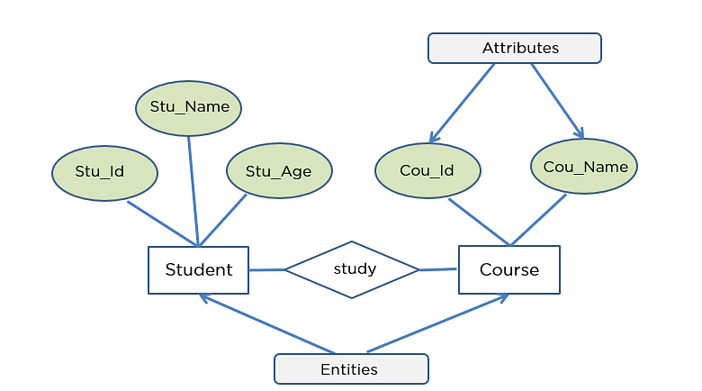
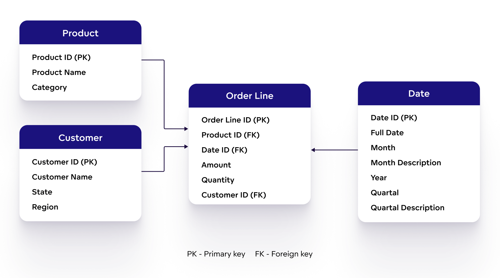
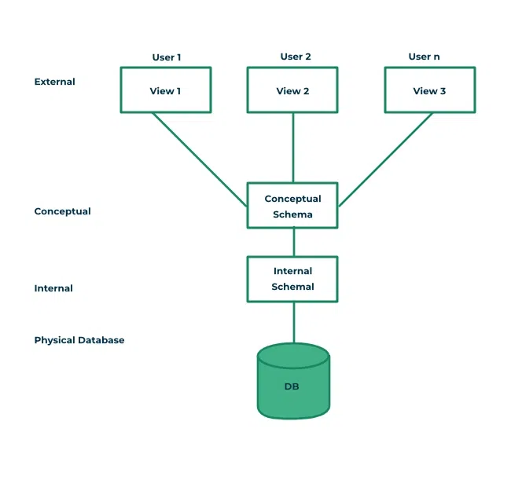

# 데이터베이스 개요

<h3>DB와 DBMS에 대해 설명하세요.</h3>

#### Database(DB)
- 구조화된 방식으로 관련있는 데이터를 전자적으로 저장한 집합
- 물리적 데이터뿐 아니라 이를 다루는 스키마 및 메타데이터까지 포함함

#### Database Management System(DBMS)
- 사용자에게 DB를 정의, 생성, 관리하는 기능을 제공하는 소프트웨어 시스템(e.g. MySQL, PostgreSQL, Oracle 등)
- 데이터를 저장하고 검색하는 기본 기능 외에도 동시성 제어, 트랜잭션 관리, 보안 등의 기능도 제공함

#### Database System
- DB, DBMS, 그리고 DBMS와 상호작용하는 프로그램 및 하드웨어를 포함한 개념
- 특정 문맥에서는 데이터베이스 시스템을 단순히 DB라고 부르기도 함

<h3>DB의 메타데이터에 대해 설명하세요.</h3>

- DB를 정의하거나 기술하는 정보(e.g. 데이터 타입, 데이터 구조, 제약 조건, 인덱스, 사용자 그룹, 보안 등)
- 카탈로그(Catalog)라고도 하며, 메타데이터가 저장되는 곳을 지칭할 때 이 용어를 쓰기도 함
- DBMS를 통해 관리됨

<h3>데이터 모델에 대해 설명하세요.</h3>

#### 개념
- DB의 구조를 기술하는데 사용되는 개념들의 집합
- 데이터 타입, 데이터 간 관계, 제약 조건 등을 정의하며, 이를 추상화해 표현할 수 있는 수단을 제공
- DB의 읽기 및 쓰기와 같은 기본 연산(operation)도 포함함

 

#### 종류
##### 개념적 데이터 모델(Conceptual Data Model)
- 일반 사용자와 개발자 모두 이해할 수 있는 추상적이고 고수준의 데이터 모델
- 주로 ER(Entity-Relationship) 모델을 사용하여 현실 세계의 데이터를 개체(entity), 속성(attribute), 관계(relationship)로 표현함

 

##### 논리적 데이터 모델(Logical Data Model)
- 개념적 데이터 모델을 구현 가능한 형태로 변환한 데이터 모델
- 특정 DBMS에 종속적으로 설계되면 안됨
- 관계형(Relational), 객체형(Object), 객체-관계형(Object-relational) 데이터 모델 등이 있으며, 관계형 데이터 모델이 가장 널리 사용됨

 

##### 물리적 데이터 모델(Physical Data Model)
- 논리적 데이터 모델을 기반으로 데이터가 실제로 하드웨어에 저장되고 관리되는 방식을 정의한 데이터 모델
- 데이터 저장소 구조 및 접근 경로(access path) 등을 정의함
- 접근 경로는 데이터 검색을 빠르게 하기 위한 구조체로, 인덱스(index) 등이 대표적임 

<h3>DB 상태에 대해 설명하세요.</h3>

- 특정 시점에 DB에 저장된 모든 데이터의 집합
- DB 인스턴스 또는 스냅샷(snapshot)이라고 부름

<h3>스키마에 대해 설명하세요.</h3>

- 데이터 모델을 바탕으로 DB의 구조, 제약 조건, 데이터 관계 등을 정의한 설계도
- DB 설계 과정에서 결정되며, 일반적으로 최초 정의된 후 자주 변경되지 않음

<h4>Three Schema Architecture에 대해 설명하세요.</h4>

#### 개념
- DB 시스템을 구축하는 아키텍처 중 하나
- 응용 프로그램과 물리적 데이터 저장소 간의 의존성을 제거하기 위함
- 세 계층(External, Conceptual, Internal)으로 구성되며, 각 계층은 독립적으로 정의된 스키마를 가짐
- 현대 DBMS는 three schema architecture를 기반으로 하지만, 완벽히 계층을 분리하지 않고 일부 혼합된 형태로 구현하는 경우가 많음

 

#### 종류
- 외부 스키마(External Schema): 특정 사용자나 응용 프로그램이 필요로 하는 데이터를 논리적 데이터 모델로 표현한 스키마
- 개념적 스키마(Conceptual Schema): DB 전체의 논리적 구조를 논리적 데이터 모델로 표현한 스키마
- 내부 스키마(Internal Schema): 데이터가 물리적으로 어떻게 저장되는지를 물리적 데이터 모델로 표현한 스키마

<h3>DDL, DML, SQL에 대해 설명하세요.</h3>

- DDL(Data Definition Language): DB 구조(개념적 스키마)를 정의하거나 변경하기 위한 명령어들의 집합
- DML(Data Manipulation Language): DB 내 데이터를 CRUD하기 위한 명령어들의 집합
- SQL(Structured Query Language): DB와 상호작용하기 위한 표준화된 질의 언어로, DDL, DML 등의 명령어 집합을 포함

<h3>관계형 데이터 모델의 주요 개념들을 수학적 이론에 기반하여 설명하세요.</h3>

> 관계형 데이터 모델은 논리적 데이터 모델 중 하나임

#### 도메인(Domain)

#### 카르테시안 프로덕트(Cartesian Product)

#### 릴레이션(Relation)

#### 튜플(Tuple)

#### n-ary 릴레이션(n-ary Relation)

<h3>슈퍼 키, 후보 키, 기본 키, 왜래 키에 대해 설명하세요.</h3>

#### 슈퍼 키(Super Key)

#### 후보 키(Candidate Key)

#### 기본 키(Primary Key, PK)

#### 왜래 키(Foreign Key, FK)

<h3>DB 제약조건에 대해 설명하세요.</h3>

#### 도메인 제약

#### 키 제약

#### 참조 무결성

