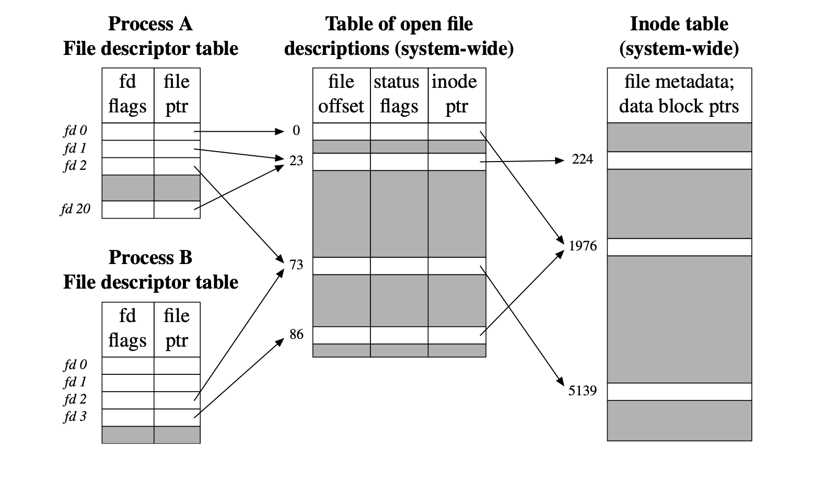

# 파일 시스템

  

<h3>파일에 대해 설명하세요.</h3>

- 보조 기억장치에 저장된 관련 있는 데이터의 논리적 집합
- 데이터(실제 내용)와 메타데이터(파일명, 크기, 권한 등)로 구성됨
- 운영체제는 파일 시스템을 통해 파일을 관리하며, 파일의 저장 위치와 접근 권한 등을 제어함

  

<h3>디렉토리에 대해 설명하세요.</h3>

- 관련된 파일이나 다른 디렉토리를 관리하기 위한 논리적 집합
- 파일이나 다른 디렉토리에 대한 참조 정보를 저장하는 특수한 형태의 파일
- 파일 시스템에서 디렉토리는 트리 구조로 조직되며, 최상위 디렉토리를 루트 디렉토리라고 부름

  

<h4>디렉토리 엔트리에 대해 설명하세요.</h4>

- 디렉토리 파일에 저장된 각 파일 및 하위 디렉토리에 대한 참조 정보
- 일반적으로 파일 이름, 파일에 대한 메타데이터, 파일 위치에 대한 포인터 정보 등이 포함됨
- 디렉토리 엔트리의 내용은 파일 시스템 종류에 따라 다를 수 있음

  

<h3>절대 경로, 상대 경로, 정규 경로에 대해 설명하세요.</h3>

#### 절대 경로(Absolute Path)
- 루트 디렉토리부터 특정 디렉토리나 파일까지의 전체 경로
- 항상 동일한 경로를 가리킴
- 예시: `/home/user/documents/file.txt`

#### 상대 경로(Relative Path)
- 현재 작업 디렉토리(CWD)를 기준으로 특정 디렉토리나 파일까지의 경로
- 현재 작업 디렉토리에 따라 달라질 수 있음
- 현재 디렉토리(`.`)와 상위 디렉토리(`..`)를 활용하여 경로를 표시함

#### 정규 경로(Canonical Path)
- 특정 디렉토리나 파일에 대한 유일한 경로
- 심볼릭 링크나 `.`, `..`과 같은 상대적 요소를 제거한 경로
- 예시: `/home/user/./documents/../file.txt`의 정규 경로는 `/home/user/file.txt`

  

<h3>파일 시스템에 대해 설명하세요.</h3>

- 저장 장치에서 데이터를 효율적으로 저장하고 관리하기 위한 운영체제의 프로그램
- 파일을 저장하는 방법, 파일의 메타데이터(이름, 크기, 생성일, 권한 등), 파일에 대한 접근 작업 등을 제어함 
- 디스크 공간을 블록 단위로 나누어 사용하며, 파일의 위치를 추적하고 디렉토리 구조를 관리하여 파일 탐색을 가능하게 함
- 보조 기억 장치를 사용하기 전에 파티셔닝과 포매팅을 해야함
- 파일 시스템의 종류에는 FAT, NFTS, ext4 등이 있음

  

<h3>파티셔닝과 포매팅에 대해 설명하세요.</h3>

#### 파티셔닝
- 저장 장치를 하나 이상의 논리적 영역으로 나누는 작업
- 파티셔닝을 통해 나누어진 영역들을 파티션이라 부름
- 각 파티션은 독립적인 저장 공간으로 인식되며, 파일 시스템을 설정할 수 있는 단위가 됨

#### 포매팅
- 저장 장치에서 사용할 파일 시스템을 결정하고 설정하여, 새로운 데이터를 쓸 수 있게 하는 작업
- 저장 장치에 대한 초기화 작업이 아님
- 각 파티션마다 다른 파일 시스템을 사용할 수 있음
- 파티셔닝과 포매팅을 완료해야 저장 장치에 파일과 디렉토리를 생성하고 데이터를 저장할 수 있음

  

<h3>파일 할당 방법에 대해 설명하세요.</h3>

#### 블록(Block)
- 운영체제가 저장 장치에서 데이터를 읽고 쓰는 최소 단위
- 저장 장치는 블록 단위로 관리되며, 블록 크기는 파일 시스템이 따라 결정됨(e.g. 4KB, 8KB)

#### 연속 할당
- 저장 장치 내의 연속적인 블록에 파일을 할당하는 방식
- 연속으로 할당된 파일에 접근하기 위해서는 파일이 할당된 첫 번째 블록의 시작 주소와 파일 크기(블록 개수)만 알면 됨
- 따라서 연속 할당을 사용하는 파일 시스템에서는 디렉터리 엔트리에 파일 이름, 첫 번째 블록의 시작 주소, 파일 크기(블록 개수)를 저장함
- 구현이 간단하지만, 외부 단편화가 발생할 수 있음

#### 불연속 할당
##### 연결 할당(Linked allocation)
- 각 블록에 다음 블록의 주소를 저장하여 블록들을 연결 리스트 형태로 관리하는 방식
- 각 블록에 데이터와 다음 블록의 주소를 저장함
- 블록을 순차적으로 따라가야 하므로 random access 불가능
- 하드웨어나 포인터 손상 시, 손상된 블록 이후의 데이터에 접근 불가

##### 인덱스 할당(Indexed allocation)
- 파일의 모든 주소를 하나의 인덱스 블록에 모아 관리하는 방식
- 인덱스 블록은 블록 번호들의 리스트로 구성되므로 원하는 블록에 random access 가능
- 디렉터리 엔트리에 파일 이름과 인덱스 블록의 주소를 저장함

  

<h3>FAT 파일 시스템 대해 설명하세요.</h3>

#### 개념
- FAT를 이용하는 연결 할당 기반의 파일 시스템
- FAT 파일 시스템은 파일 블록을 연결 리스트로 관리하지만, 연결 정보를 FAT(File Allocation Table)에 저장함으로써 연결 할당의 단점을 개선함
- USB, SD 카드와 같은 저용량 저장 장치에서 주로 사용됨 
- 테이블 엔트리 크기에 따라 FAT12, FAT16, FAT32가 있음

##### 예시
| **블록 번호** | **다음 블록 주소** |
|-----------|--------------|
| 0         | 0            |
| 1         | 0            |
| 2         | 5            |
| 3         | 0            |
| 4         | 0            |
| 5         | 7            |
| 6         | 0            |
| 7         | EOF          |

 

#### 파일 시스템 구조
1. 예약 영역: 디스크의 첫 번째 섹터로 파일 시스템 정보를 포함하며, 운영체제 부팅에 필요한 정보 저장
2. FAT 영역: FAT가 저장되는 공간
3. 루트 디렉터리 영역: 디렉터리 엔트리(파일명, 확장자, 시작 블록 번호, 파일 크기 등) 저장 
4. 데이터 영역: 실제 파일 데이터가 저장되는 공간으로, 디스크의 대부분을 차지

<h4>FAT32 파일 시스템에서 저장할 수 있는 최대 단일 파일 크기는 얼마인가요?</h4>

- 답: 4GB
- 이유: 파일 크기를 나타내는 디렉터리 엔트리의 필드가 32비트이므로

  

<h3>유닉스 파일 시스템에 대해 설명하세요.</h3>

#### 개념
- inode를 이용하는 인덱스 할당 기반의 파일 시스템
- inode에는 파일 속성 정보(UID, GID, 권한 등) 및 블록 주소(15개) 저장
- 디렉터리 엔트리는 파일 이름과 inode 번호로 구성

#### 파일 시스템 구조
1. 예약 영역: 운영체제 부팅에 필요한 정보 저장 
2. inode 영역: inode가 저장되는 공간
3. 데이터 영역: 실제 파일 및 디렉토리 정보 저장

  

<h4>inode가 직접/간접 블록 포인터를 통해 대용량 파일을 관리하는 방식에 대해 설명하세요.</h4>

##### 간접 블록
- 단일 간접 블록(single indirect block): 파일 데이터를 저장한 블록 주소가 저장된 블록
- 이중 간접 블록(double indirect block): 단일 간접 블록을 가리키는 포인터
- 삼중 간접 블록(triple indirect block): 이중 간접 블록을 가리키는 포인터

 

##### 관리 방식
1. 12개의 블록 주소는 직접 블록 주소 저장
2. 1번으로 충분하지 않다면 13번째 주소에 단일 간접 블록 주소 저장
3. 2번으로도 충분하지 않다면 14번째 주소에 이중 간접 블록 주소 저장
4. 3번으로도 충분하지 않다면 15번째 주소에 삼중 간접 블록 주소 저장

  

<h4>블록 크기가 4KB이고 주소 크기가 4B인 경우, 하나의 단일/이중/삼중 간접 블록은 각각 몇개의 데이터 블록을 가리킬 수 있나요?</h4>

- 단일 간접 블록이 가리킬 수 있는 데이터 블록의 개수 = 단일 간접 블록이 저장할 수 있는 주소의 개수 = 블록 크기 / 주소 크기 = 4KB / 4B = 2^10개
- 이중 간접 블록이 가리킬 수 있는 데이터 블록의 개수 = 단일 간접 블록이 가리킬 수 있는 데이터 블록의 개수^2 = 2^20개 
- 삼중 간접 블록이 가리킬 수 있는 데이터 블록의 개수 = 이중 간접 블록이 가리킬 수 있는 데이터 블록의 개수^2 = 2^30개 

  

<h4>100MB의 파일을 저장하기 위해 inode의 몇 번째 블록 포인터까지 사용해야하나요?</h4>

- 직접 블록: 12개 (48KB)
- 단일 간접 블록 포인터: 1개 (4MB)
- 이중 간접 블록 포인터: 1개
- 삼중 간접 블록: 0개

  

<h4>파일 디스크립터에 대해 설명하세요.</h4>

##### 개념
- 운영체제가 파일, 소켓, 파이프 등의 자원을 식별하고 관리하기 위해 사용하는 고유한 정수 값
- 프로세스가 자원을 요청하면 운영체제는 파일 디스크립터를 생성하여 반환하고, 프로세스는 반환받은 파일 디스크립터를 사용하여 자원에 접근하고 작업을 수행함
- 파일 디스크립터는 프로세스별로 고유한 값을 가지며, 작은 값부터 순차적으로 할당됨(e.g. 0: `stdin`, 1: `stdout`, 2: `stderr`)

##### 구조
- 파일 디스크립터 테이블: 각 프로세스별로 유지되는 테이블로, 파일 디스크립터 번호와 파일 테이블 엔트리 매핑
- 파일 테이블: 파일 디스크립터 테이블이 참조하는 구조체, 파일의 상태와 작업과 정보 등을 관리
- inode 테이블: inode가 저장된 테이블

> **주의**  
> 파일 디스크립터 테이블은 프로세스별로 고유하지만, 파일 테이블과 inode 테이블은 시스템 전역에서 공유됨

  

<h4>하드 링크와 심볼릭 링크에 대해 설명하세요.</h4>

##### 하드 링크
- 기존 파일의 inode를 참조해 동일한 데이터를 가리키는 또 다른 파일명을 생성하는 방식
- 같은 inode를 공유하므로, 파일명은 여러 개일 수 있지만 실제 데이터는 하나만 존재
- 원본 파일이나 하드 링크 중 하나를 삭제해도 나머지 링크를 통해 데이터에 계속 접근 가능
- 모든 하드 링크가 삭제되어야 inode와 데이터 블록이 파일 시스템에서 해제됨
- inode 번호를 기반으로 하기 때문에 같은 파일 시스템 내에서만 생성 가능
- 루프 방지를 위해 디렉터리에는 생성 불가

##### 심볼릭 링크
- 파일의 경로를 참조하는 새로운 파일을 생성하는 방식
- 실제 데이터를 가리키는 것이 아니라, 원본 파일의 경로를 저장하는 별도의 파일임 
- 원본 파일과는 별개의 inode를 가지며, 원본 파일의 inode를 직접 참조하지 않음
- 원본 파일이 삭제되면 심볼릭 링크 파일은 더이상 유효하지 않은 깨진 링크가 됨
- 경로 기반 참조이므로 다른 파일 시스템에서도 생성 가능
- 파일 뿐 아니라 디렉터리에도 생성 가능

  

<h4>마운트에 대해 설명하세요.</h4>

- 외부 장치나 파일 시스템을 현재 운영 중인 파일 시스템의 특정 디렉터리(mount point)에 연결하는 작업
- 사용자는 마운트된 장치를 해당 디렉터리 경로를 통해 파일처럼 접근할 수 있음
- 마운트된 파일 시스템은 해당 경로 아래에 논리적으로 병합되며, 단일 파일 시스템 구조에서 일관된 파일 관리가 가능함

